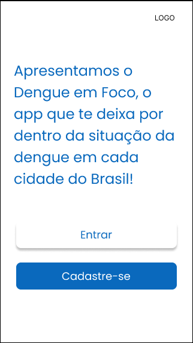
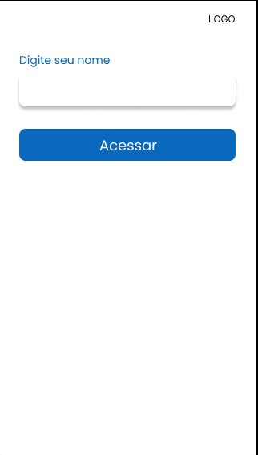
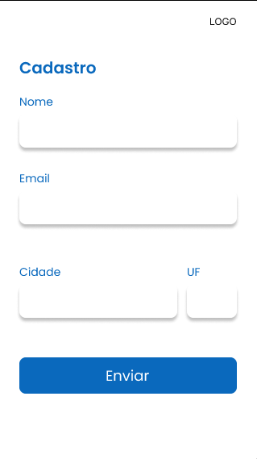
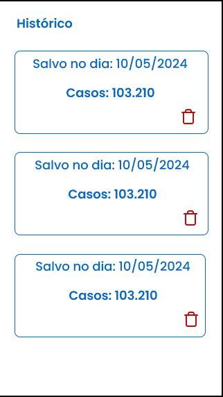
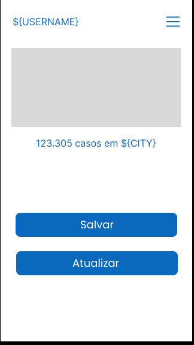

# dengue_em_foco

Este projeto foi idealizado como parte do currículo da disciplina de Desenvolvimento Mobile com Kotlin, sob a orientação do professor [Lucas Leite](https://github.com/lucassampaioleite). Sua concepção visa proporcionar aos alunos uma experiência prática e aplicada, consolidando os conhecimentos adquiridos ao longo do curso. Buscamos não apenas desenvolver habilidades técnicas, mas também promover a criatividade, a resolução de problemas e a colaboração em equipe.

|  Screnn  |                  Image                   |
| :------: | :--------------------------------------: |
|   Home   |        |
|  Login   |     |
| Register |  |
| History  |  |
| Profile  |  |
